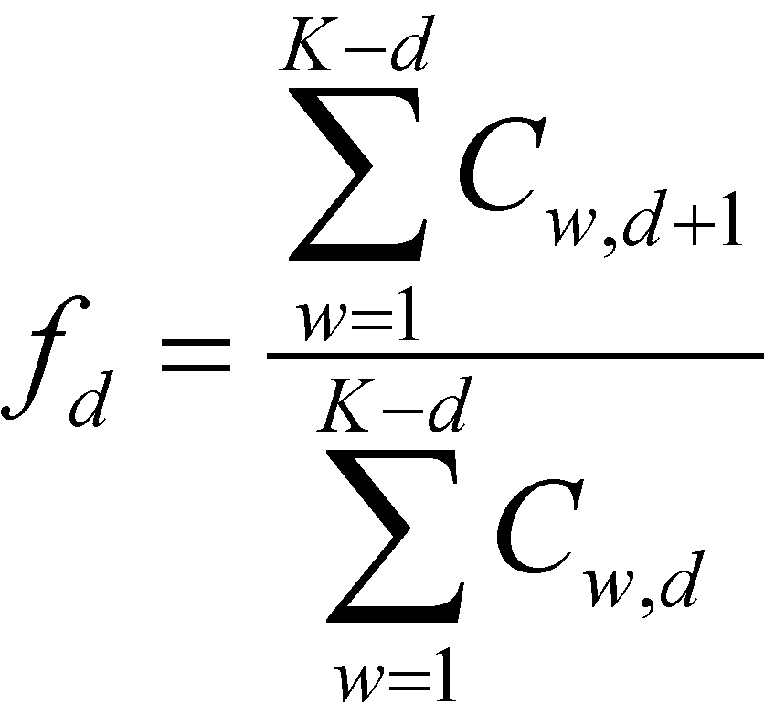
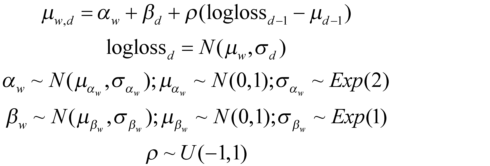
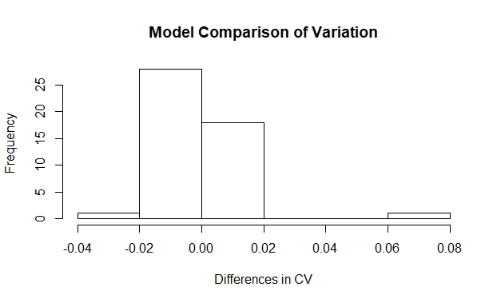

```{r setup, include=FALSE}
library(knitr)
knitr::opts_chunk$set(echo = TRUE)
setwd("D:/Google Drive/Statistics/actuarialsci/writing")
```

##Abstract
This paper investigates the substitution of adaptive priors for standard uninformed priors in an application of Bayesian stochastic loss reserve forecasting. Results show that both methods work similarly well in comparison to more analytical methods. However, both models generate outliers in loss prediction for lower-value claims. 

##Intro
Unknown future costs, including claim re-evaluations and delayed litigatio, create uncertainty in loss reserve forcasting. Chain ladders are cost functions (Mack 1991) that predict the next incurred losses in period d + 1 in a given year. 

```{r, echo=FALSE}

```

The assumptions of this model include the naive expectation that the loss in the next period is a function of past periods, that, for a given line of insurance, each year is independent, and the variance is conditional on the fixed effect of the model. 

Over the last two decades, stochastic and Bayesian stochastic models have been adopted by the actuarial science community. Buiding on Mack, Meyers finds that Bayesian stochastic models provide favorably more uniform predictions compared to strictly analytical models. It does this by relaxing the fixed effect assumption for accident year and allowing dependence (Rho) among accident years.


###Data

The loss reserving data comes directly from the Casualty Actuarial Society database, NAIC Schedule P. There are data sets for six industries. However, for the purposes of this analysis, the commerical auto data set was the only set analyzed. Insurance groups were selected in order to exclude observations where exogenous changes in business practices may have occurred. (Meyers)

###The Model

This paper makes a small contribution of testing Meyer's model and data using adaptive priors. 

```{r, echo=FALSE}

```

Rather than setting $\alpha_w$ as a function of a fixed premium, it is given its own adaptive priors that are a function of the data. Furthermore, variance hyperparameters $\sigma_\alpha$ and $\sigma_\beta$ have been given exponential, rather than uniform, distributions. 

###Results

Both Meyers original CCL model and the adaptive prior model were executed. Results for Meyers model exactly matched the original monograph. The adaptive prior model usually generated similar, but not identical results.

```{r}

```

A paired t-test rejects the hypothesis that the variation is different between models (p=0.42, df=47).

Both tests made large errors in modeling 

```{r, echo=FALSE}
include_graphics("table/table.png")
```


